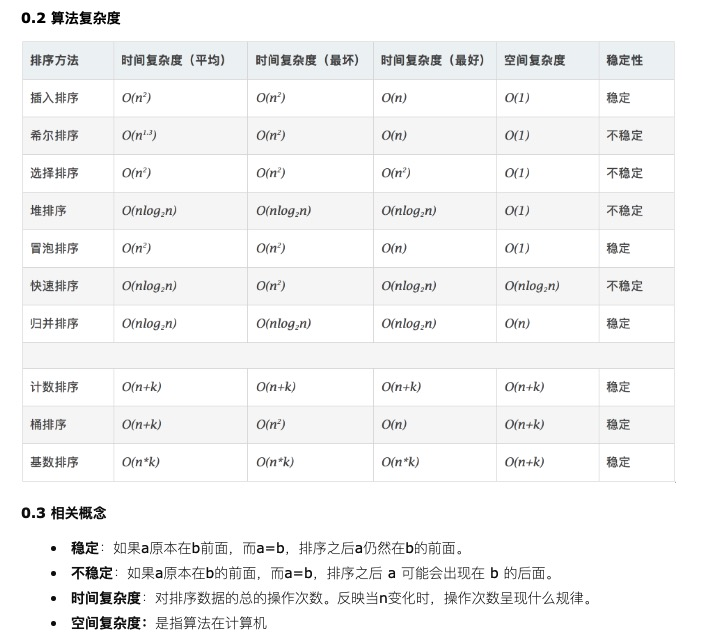

参考：
https://www.cnblogs.com/onepixel/p/7674659.html

http://www.codeceo.com/article/10-sort-algorithm-interview.html#0-tsina-1-10490-397232819ff9a47a7b7e80a40613cfe1

总结

在前面的介绍和分析中我们提到了冒泡排序、选择排序、插入排序三种简单的排序及其变种快速排序、堆排序、希尔排序三种比较高效的排序。后面我们又分析了基于分治递归思想的归并排序还有计数排序、桶排序、基数排序三种线性排序。我们可以知道排序算法要么简单有效，要么是利用简单排序的特点加以改进，要么是以空间换取时间在特定情况下的高效排序。但是这些排序方法都不是固定不变的，需要结合具体的需求和场景来选择甚至组合使用。才能达到高效稳定的目的。没有最好的排序，只有最适合的排序。

下面就总结一下排序算法的各自的使用场景和适用场合。

1. 从平均时间来看，快速排序是效率最高的，但快速排序在最坏情况下的时间性能不如堆排序和归并排序。而后者相比较的结果是，在n较大时归并排序使用时间较少，但使用辅助空间较多。

2. 上面说的简单排序包括除希尔排序之外的所有冒泡排序、插入排序、简单选择排序。其中直接插入排序最简单，但序列基本有序或者n较小时，直接插入排序是好的方法，因此常将它和其他的排序方法，如快速排序、归并排序等结合在一起使用。

3. 基数排序的时间复杂度也可以写成O(d*n)。因此它最使用于n值很大而关键字较小的的序列。若关键字也很大，而序列中大多数记录的最高关键字均不同，则亦可先按最高关键字不同，将序列分成若干小的子序列，而后进行直接插入排序。

4. 从方法的稳定性来比较，基数排序是稳定的内排方法，所有时间复杂度为O(n^2)的简单排序也是稳定的。但是快速排序、堆排序、希尔排序等时间性能较好的排序方法都是不稳定的。稳定性需要根据具体需求选择。

5. 上面的算法实现大多数是使用线性存储结构，像插入排序这种算法用链表实现更好，省去了移动元素的时间。具体的存储结构在具体的实现版本中也是不同的。
